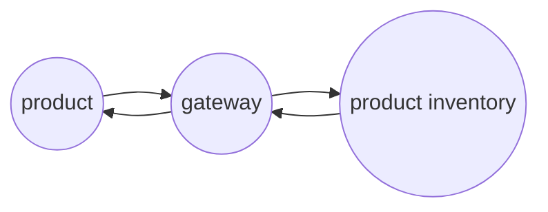

App de exemplo para a talk de introdução ao Micronaut

```mermaid
graph LR
A((product))  --> C((gateway))
B((product invetory)) --> C
C((gateway)) --> A((product))
C((gateway)) --> B((product inventory))
```

run docker with `docker run -p 8500:8500 consul`

